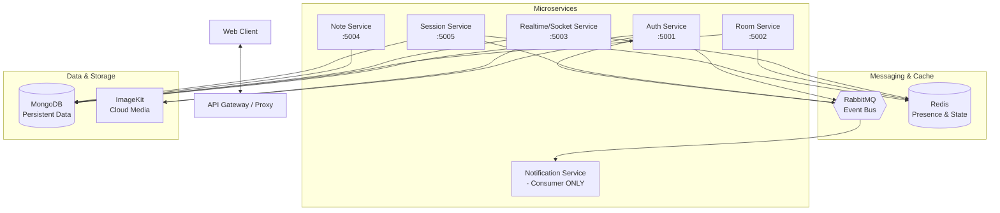
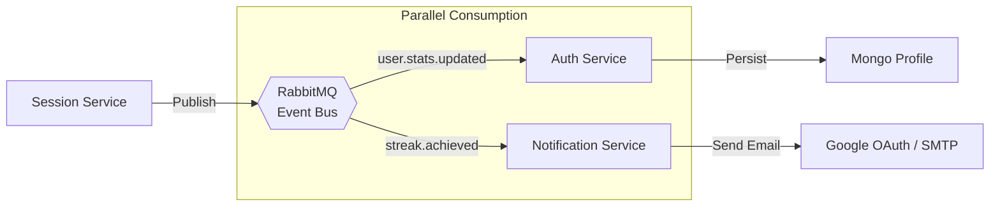
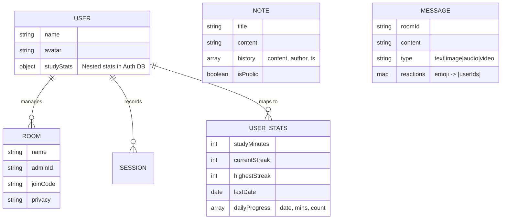
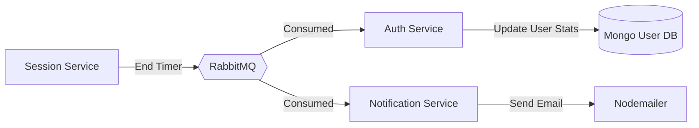
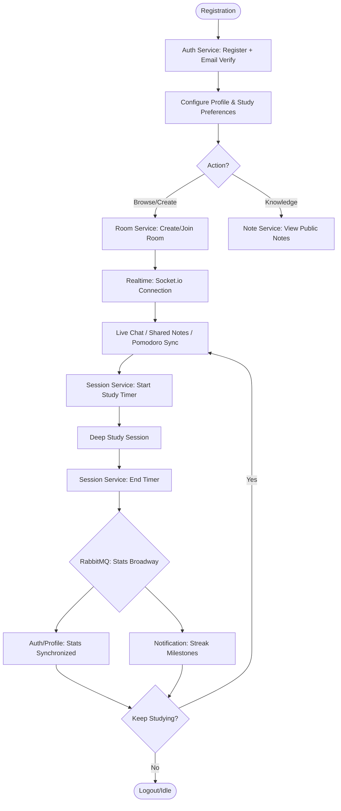

# Co-Learn Backend 🚀

[](https://nodejs.org/)
[](https://expressjs.com/)
[](https://www.mongodb.com/)
[](https://redis.io/)
[](https://www.rabbitmq.com/)
[](https://www.docker.com/)
[](https://socket.io/)
[](https://jwt.io/)
[](https://developers.google.com/identity/protocols/oauth2)
[](https://nodemailer.com/)
[](https://imagekit.io/)

**Co-Learn** is a comprehensive microservices-based backend for a collaborative study platform. It integrates real-time presence, study tracking with gamification (streaks), collaborative markdown notes, and automated notifications.

---

## 🏗️ Microservices Architecture



---

## 🔌 Realtime Service: Deep Dive

The **Realtime Service** (`:5003`) is the most interactive layer of the Co-Learn ecosystem. Built on **Socket.io** and optimized with **Redis**, it manages all live room states.

### 📝 Collaborative Notes (Real-time Markdown)
Features an advanced synchronization layer for multiple editors:
- **Instant Deltas**: Edits are broadcasted as they happen using low-latency WebSocket frames.
- **Optimistic Locking**: When a user starts typing, the service sets a `note-lock:<roomId>` in **Redis** with a TTL. This prevents 2+ users from overwriting each other simultaneously by notifying others that the note is currently being "held".
- **Auto-unlocking**: The lock is automatically released after a period of inactivity or if the current editor disconnects.

### 💬 Interactive Chat & Rich Media
A sophisticated messaging subsystem that goes beyond simple text:
- **Persistence**: Messages are saved in **MongoDB** (`colearn_realtime` db) for history preservation but delivered in real-time to all online users.
- **Dynamic Reactions**: Users can add emoji reactions to any message. The service performs partial document updates in MongoDB and broadcasts the updated reaction map instantly.
- **Typing Indicators**: Ephemeral `typing-start` and `typing-stop` events are broadcasted to provide a lifelike chat experience.
- **Integrated Media Sharing**: 
    - The client uploads files (Images, Videos, Audio) to the Realtime service's `/api/chat/upload` endpoint.
    - The service pushes the file to **ImageKit** and receives a secure, optimized CDN URL.
    - This URL is then broadcasted within a `rich-message` event to all participants.

### ⏱️ Synchronized Pomodoro Master-Timer
A room-wide study timer that remains consistent for all participants:
- **The Master State**: The current timer status (Time Left, Is Running, Duration) is stored in **Redis**.
- **Drift Compensation (Sync)**: When a new user joins a room, they don't start a local timer. Instead, they emit `pomo:sync`, and the server retrieves the current master state from Redis, ensuring all users see the exact same second.
- **Server Notifications**: When the timer reaches zero, the server initiates the `pomo:complete` event, allowing all clients to trigger transitions simultaneously.

### 🟢 Presence & Internal Security
- **Socket Auth Middleware**: Every connection request must pass a **JWT handshake**. The server validates the token against the **Auth service's secret** and confirms the session isn't blacklisted in Redis.
- **Redis Presence Registry**: Active participants are stored in a Redis `SET` for each room. This allows for an instant `get-participants` list that is decoupled from the message persistence layer.
- **Automatic Cleanup**: On socket disconnection, the user is removed from the Redis registry, and a `user-left` event is automatically broadcasted to the room.

---

## 📡 Event-Driven Backbone: RabbitMQ & Notifications

The **Co-Learn** architecture is built on a "Choreography" pattern. Instead of services calling each other directly via HTTP (which can lead to slow response times and cascading failures), they communicate asynchronously through **RabbitMQ**.

### 🛠️ Why RabbitMQ is Critical?
- **Asynchronous Decoupling**: When a study session ends, the `Session Service` just "shouts" an event to RabbitMQ and immediately returns success to the user. It doesn't wait for emails to send or other databases to update.
- **Fault Tolerance**: If the `Notification Service` is temporarily down, RabbitMQ holds the messages in a persistent queue. Once the service is back online, it processes the backlog without data loss.
- **Scalability**: High-throughput events (like stats updates) can be distributed across multiple consumer instances to prevent bottlenecks.

### 🔔 Notification Service (The Smart Consumer)
The **Notification Service** acts as a background sidecar. It holds no public API but is vital for user engagement:
- **Streak Celebrations**: Consumes the `streak.achieved` event to send high-fidelity HTML emails using **Google OAuth2**.
- **Real-time Alerts**: Listens for system-wide milestones to trigger user-facing notifications.

### 📋 Major System Events
| Event Name | Producer | Consumer(s) | Impact |
|------------|----------|-------------|--------|
| `user.stats.updated` | Session | Auth | Updates user's total study minutes and streak in the primary profile. |
| `streak.achieved` | Session | Notification | Triggers a "congratulations" email for new study streaks. |
| `session.ended` | Session | Notification | Logs the end of a session for audit and potential room cleanup. |



---

## 🛠️ Exhaustive API Documentation

### 🔐 Auth Service (`:5001`)
| Method | Endpoint | Description |
|--------|----------|-------------|
| POST   | `/api/auth/register` | Initial registration with avatar support |
| POST   | `/api/auth/verify-registration` | Verify account via OTP |
| POST   | `/api/auth/login` | Authenticate and receive JWT tokens |
| GET    | `/api/auth/logout` | Clear current user session |
| POST   | `/api/auth/logout-all` | Invalidate all active sessions |
| POST   | `/api/auth/refresh-token` | Renew expired access tokens |
| POST   | `/api/auth/forgot-password` | Initiate password recovery |
| POST   | `/api/auth/reset-password` | Complete password reset |
| GET    | `/api/auth/current-user` | Detailed profile & live study stats |
| PATCH  | `/api/auth/update-profile` | Update display name or avatar |
| GET    | `/api/auth/check-email` | Validate email availability |
| GET    | `/api/auth/google` | Trigger Google OAuth2 login |
| GET    | `/api/auth/google/callback` | OAuth2 callback handler |

### 🏠 Room Service (`:5002`)
| Method | Endpoint | Description |
|--------|----------|-------------|
| POST   | `/api/rooms/create-room` | Initialize new study room |
| POST   | `/api/rooms/join-room-by-code` | Join room via unique code |
| GET    | `/api/rooms/get-my-rooms` | List rooms user has joined |
| GET    | `/api/rooms/get-room-by-id/:id` | Detailed room metadata |
| DELETE | `/api/rooms/delete-room/:id` | Permanently remove room (Admin) |
| DELETE | `/api/rooms/leave-room/:id` | Exit room and cleanup presence |
| POST   | `/api/rooms/kick-member/:id/:mId` | Remove participant (Admin) |
| PATCH  | `/api/rooms/update-settings/:id` | Update room name/privacy |

### ⏱️ Session Service (`:5005`)
| Method | Endpoint | Description |
|--------|----------|-------------|
| POST | `/api/sessions/end` | Close study & sync |
| GET | `/api/sessions/stats` | Streaks & daily totals |
| GET | `/api/sessions/charts` | Chart data (week/month) |

### 📝 Note Service (`:5004`)
| Method | Endpoint | Description |
|--------|----------|-------------|
| GET    | `/api/notes/:roomId` | Fetch current room note |
| POST   | `/api/notes/:roomId/save` | Create a versioned history snapshot |
| GET    | `/api/notes/:roomId/history` | List all historical versions |
| GET    | `/api/notes/:roomId/history/:vId` | Recover specific version |
| POST   | `/api/notes/:roomId/history/:vId/restore` | Revert to previous state |
| GET    | `/api/notes/:roomId/export` | Export as MD or PDF |

---

## 📊 Visual technicalities

### ER Diagram: Comprehensive Entities


### Data Flow Diagram (DFD): Study Stats Sync

 
### End-to-End Operational Flowchart

---

## ⚙️ .env Configuration Per Service

Required to run successfully:

| Variable | auth | room | sess | note | realtime |
|----------|------|------|------|------|----------|
| MONGO_URI| ✅ | ✅ | ✅ | ✅ | ✅ |
| REDIS_URI| ❌| ✅ | ✅ | ❌| ✅ |
| RABBITMQ_URI | ✅ | ✅ | ✅ | ✅ | ✅ |
| JWT_SECRET| ✅ | ✅ | ✅ | ✅ | ✅ |
| IMAGEKIT_KEYS| ✅ | ❌| ❌| ❌| ✅ |
| CLIENT_ID | ✅ | ❌| ❌| ❌| ❌|

---

## 🚀 Run with Docker
```bash
docker-compose up --build
```

---

## 🛡️ License
MIT License.
